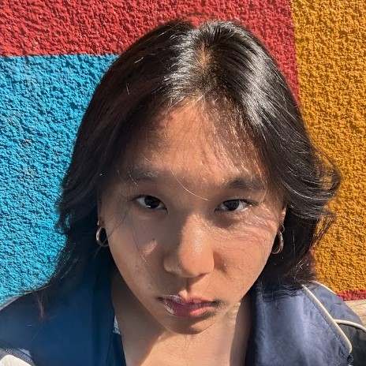

## About Me

I am a fourth year undergraduate at UCSD studying pure math. In my free time I enjoy weightlifting, knitting, reading, watching movies, and going to art museums. My favorite movie is *Fury* dir. David Ayer, my favorite book is *Martyr!* by Kaveh Akbar, and my favorite painter is Caravaggio. 

You can contact me at myl010 *at* ucsd *dot* edu.

$$e^{2\pi i} = 1$$

## Research Interests
I am broadly interested in low-dimensional topology, Lie theory, and classical geometry. 

## Publications

1. Closest Point Exterior Calculus. **Mica Li**, Michael Owens, Juheng Wu, Grace Yang, Albert Chern. SIGGRAPH Asia Posters, 2023.

## Presentations

Year | Location | Title
2024 | UCSD  | An Introduction to Riemannian Manifolds
2023 | UCSD Summer Research Conference| Harmonic Functions in Lie Sphere Geometry
2023 | UCSD | Geometry Processing with Closest Point Exterior Calculus
2022 | UCSD | Proposal of a New Method to Solving PDEs on Surfaces

## Notable Awards & Honors

Year | Award 
2021 - Present | Provost Honors
2023 | Ledell Family Research Scholarship for Science and Engineering

